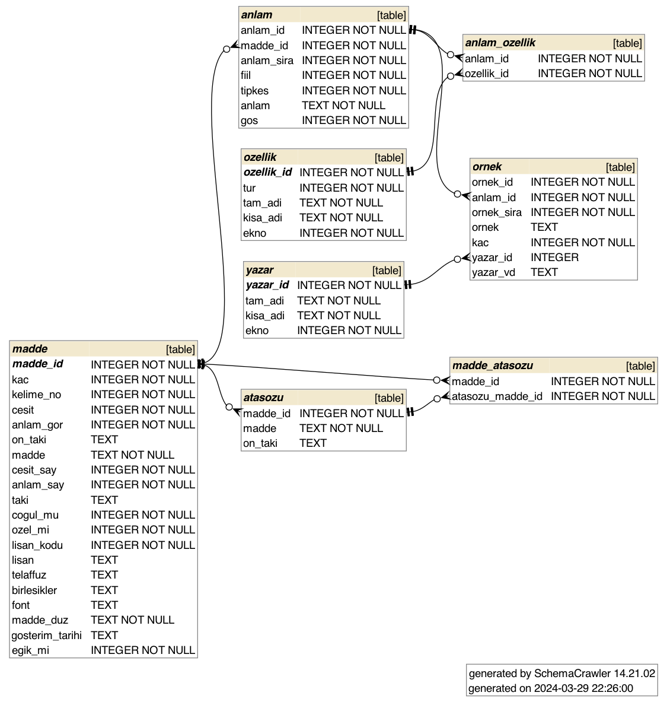

# Projenin Amacı
Türk Dil Kurumu'nun yayınladığı Güncel Türkçe Sözlük'ü yazılımcıların kullanabileceği bir hale getirmek. Şu anda proje içerisinde 99.236 adet madde en güncel haliyle bulunmaktadır.

Sözlüğü üç farklı türde indirebilirsiniz.
1. JSON dosyası olarak: [v12.gts.json.tar.gz](sozluk/v12/v12.gts.json.tar.gz)
2. MongoDB archive dosyası olarak: [v12.gts.mongo7.gzip.archive](sozluk/v12/v12.gts.mongo7.gzip.archive)
3. SQLite veritabanı olarak: [v12.gts.sqlite3.db](sozluk/v12/v12.gts.sqlite3.db)

## JSON
İndirdiğiniz dosya GZIP ile sıkıştırılmıştır. Sıkıştırmayı açtıktan sonra içeriğini herhangi bir text editörle görüntüleyebilirsiniz.

## MongoDB
İndirdiğiniz dosyayı aşağıdaki komutun yardımıyla kendi MongoDB sunucunuza aktarabilirsiniz.

`mongorestore --gzip --archive=v12.gts.mongo7.gzip.archive`

## SQLite
İndirdiğiniz dosyayı herhangi bir SQLite görüntüleyici ile görüntüleyebilirsiniz ve kullanabilirsiniz. Veritabanının şeması aşağıdaki gibidir.

# Güncel Türkçe Sözlük
Türk Dil Kurumunun 1945'ten beri yayımlanan Türkçe Sözlük'ünün 2023 yılında yapılan 12. baskısının gözden geçirilip güncellenmiş olarak genel ağdan sunulan sürümüdür. Türkçe Sözlük dilimizde yaşanan gelişmelere bağlı olarak sürekli güncellenmektedir.

http://www.sozluk.gov.tr/

# Eski Sürümler
TDK tarafından sunulan ve internette bulunun eski sözlüklere aşağıdaki linklerden ulaşabilirsiniz.

## Güncel Türkçe Sözlük, 11. Baskı
TDK'nın 2023 yılı öncesinde yayınladığı Güncel Türkçe Sözlük'ün 11. baskısına [sozlük/v11 klasörü](sozluk/v11) altındaki dosyalardan ulaşabilirsiniz. On birinci baskı içerisinde 92.406 adet madde bulundurmaktadır.

## Güncel Türkçe Sözlük, 2007 Baskısı
TDK'nın 2007 yılında yayınladığı sözlüğe [sozlük/backup-2007 klasörü](sozluk/backup-2007) altındaki dosyalardan ulaşabilirsiniz. Eski sözlük içerisinde 73.707 adet madde bulundurmaktadır.
