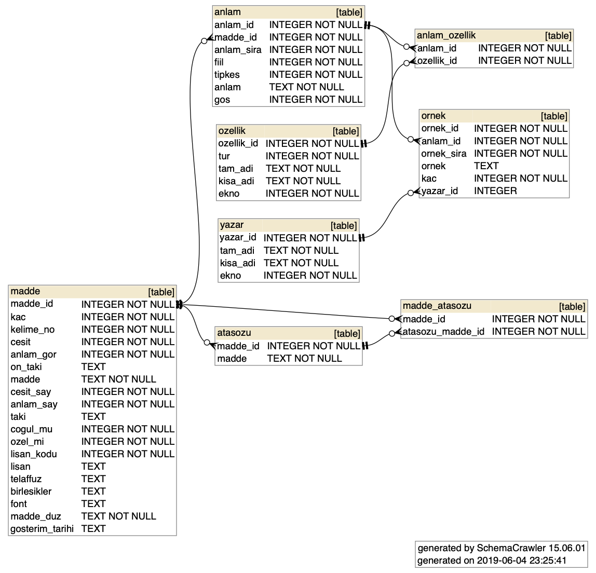

# Türk Dil Kurumu 11. Baskı
Proje içerisinde 92.406 adet madde bulunmaktadır.

Sözlüğü üç farklı türde indirebilirsiniz.
1. JSON dosyası olarak: [gts.json.tar.gz](v11.gts.json.tar.gz)
2. MongoDB archive dosyası olarak: [gts.mongo4.gzip.archive](v11.gts.mongo4.gzip.archive)
3. SQLite veritabanı olarak: [gts.sqlite3.db](v11.gts.sqlite3.db)

## JSON
İndirdiğiniz dosya GZIP ile sıkıştırılmıştır. Sıkıştırmayı açtıktan sonra içeriğini herhangi bir text editörle görüntüleyebilirsiniz.

## MongoDB
İndirdiğiniz dosyayı aşağıdaki komutun yardımıyla kendi MongoDB sunucunuza aktarabilirsiniz.

`mongorestore --gzip --archive=v11.gts.mongo4.gzip.archive`

## SQLite
İndirdiğiniz dosyayı herhangi bir SQLite görüntüleyici ile görüntüleyebilirsiniz ve kullanabilirsiniz. Veritabanının şeması aşağıdaki gibidir.

# TDK 2007 Sözlüğü
TDK'nın 2007 yılında yayınladığı sözlüğe ise old klasöründeki [TDK-2007.rar](../../old/TDK-2007.rar) dosyasından ulaşabilirsiniz. Eski sözlük içerisinde 73.707 adet madde bulundurmaktadır.

# Güncel Türkçe Sözlük
Türk Dil Kurumunun 1945'ten beri yayımlanan Türkçe Sözlük'ünün 2011 yılında yapılan 11. baskısının gözden geçirilip güncellenmiş olarak genel ağdan sunulan sürümüdür. Türkçe Sözlük dilimizde yaşanan gelişmelere bağlı olarak sürekli güncellenmektedir.

http://www.sozluk.gov.tr/
